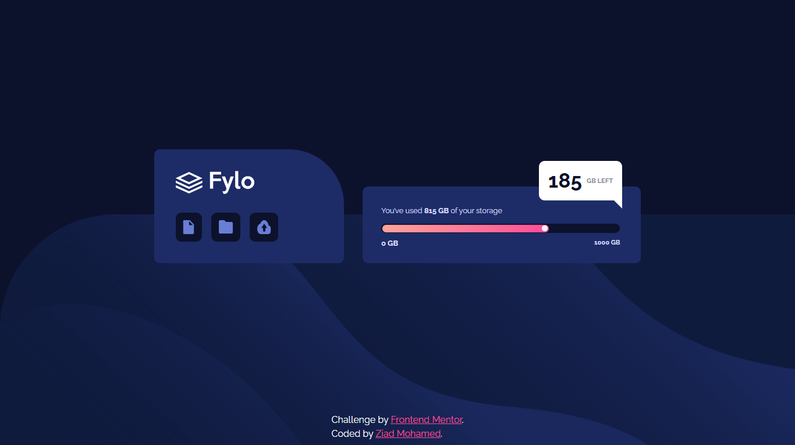

# 💾 Fylo Data Storage Component

  

A responsive data storage component built with HTML and CSS as part of a Frontend Mentor challenge.

## 📖 About the Challenge

The goal was to build a responsive Fylo data storage component and make the layout closely match the provided design across different screen sizes.

## ✨ Highlights

- 📱 Fully responsive layout for mobile and desktop screens.
- 🎯 Precise positioning of the storage indicator across different layouts.
- 📐 Responsive layout using Flexbox.
- 🎨 Progress bar with a gradient fill and custom indicator.
- 🖼️ Responsive background images for mobile and desktop.
- 💬 Custom styling for the remaining storage information.
- 🔺 CSS pseudo-element used to create the desktop speech-bubble pointer.
- 🧩 Modern CSS techniques such as `min-height: 100dvh`, logical properties, and `text-wrap`.

## 🛠️ Built With

  

## 💡 Key Takeaways

- Improved my understanding of responsive layouts using Flexbox.
- Practiced controlling the position of absolutely positioned elements across different breakpoints.
- Learned how to reposition the storage indicator between mobile and desktop layouts.
- Practiced using CSS pseudo-elements to create custom visual shapes.
- Improved my understanding of responsive background images and positioning.
- Practiced combining Flexbox, absolute positioning, transforms, and media queries to achieve accurate layouts.
- Continued improving my use of modern CSS features and logical properties.

## 🔗 Links

- 🌐 **Live Site:** https://frontend-mentor-fylo-data-storage-c.vercel.app/
- 💻 **Repository:** https://github.com/Ziad-mo205/Frontend-Mentor---Fylo-data-storage-component.git
- 🎯 **Frontend Mentor Solution:** https://www.frontendmentor.io/solutions/responsive-page-using-flexbox-_LGrsp4-Tu
